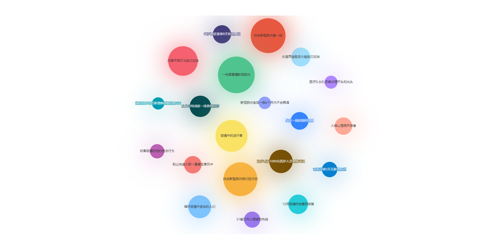

# will
前端学习笔记

## 14,  DataV + element
简单的实现轮播表格，还能按照年份再刷新数据     

## 15， Vue组件间传值
- 子传父
- 父传子
- 兄弟传

## 22. id选择器
:love_letter: 结论：什么也不会发生，该正确解析的还是正确解析，但是开发时不建议使用相同的 id，因为容易造成文档结构混乱。

## 24. element 制作form
element-ui 的 tabs、timepiker、table、input 等组件的使用           
:dolphin: **注意** vue table 设置rowClassName不生效的问题？          
该样式不能写在scoped当中，而应写在全局样式中         

## 25. echarts 制作词云图
直接操作dom，不规范，待改进代码

